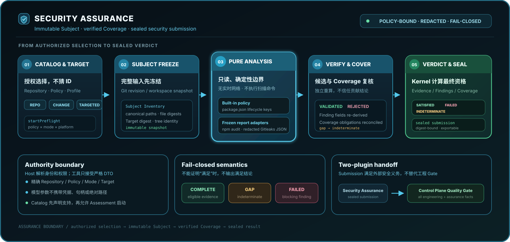

# DSH Security Assurance

> DeepSeek Harness 的策略驱动仓库安全评估插件 · 中文默认，English below

  

## 中文

### 这是什么

<code>dsh-security-assurance</code> 为 [DeepSeek Harness](https://github.com/deepseek-ai/deepseek-harness) 提供证据驱动的仓库安全评估。它通过公开的 Harness/Cordis 接口接入，不修改 Harness Core，并把评估过程封装为可查询、可恢复、可审计的版本化结果。

这是一个安全保障插件，不是通用漏洞扫描器。当前内建能力包括 Node 项目的 <code>package.json</code> 安装生命周期检查、npm 发布面、pnpm 锁文件完整性、GitHub Actions 权限与不可变依赖检查，以及对冻结 <code>npm-audit.json</code> 和 Gitleaks v8 JSON 报告的纯归一化与独立验证。

一次扫描发现不等于可审计的安全结论：输入可能被篡改、截断，或与冻结仓库不一致。Security Assurance 只接收冻结 Subject 上的已验证 slice，并在独立验证和 sealed submission 后给出 verdict。

### 评估如何形成可信结论

  

Service 先解析授权 Catalog 选择并冻结完整 Subject，再把已验证 slice 交给合格的 PURE Analyzer 或报告归一化器。Candidate 和 Coverage 必须经过独立复核，Kernel 才能计算 <code>SATISFIED</code>、<code>FAILED</code> 或 <code>INDETERMINATE</code>，并为终态 Assessment 生成摘要绑定的 Submission。

### 当前版本

- 版本：<code>0.1.0-rc.14</code>
- 状态：Release Candidate（预发布版）
- 适配：DeepSeek Harness <code>0.1.2-alpha.1</code>（主目标）；<code>0.1.2-alpha.2</code> 至 <code>0.1.2-rc.1</code>、<code>0.1.3-alpha.1</code>、<code>0.1.3-alpha.2</code>、<code>0.1.5-alpha.1</code>、<code>0.1.5-alpha.2</code>、<code>0.1.5-rc.1</code> 与 <code>0.1.5-rc.2</code> 经兼容矩阵验证
- GitHub：[v0.1.0-rc.14 Release](https://github.com/bailong-Hakuryu/dsh-security-assurance/releases/tag/v0.1.0-rc.14)

### 支持范围

| 项目 | 当前状态 |
| --- | --- |
| 评估模式 | <code>REPOSITORY</code>、精确提交或 Mission 产出工作区的 <code>CHANGE</code>，以及默认策略的 <code>TARGETED</code> |
| 支持 Subject | <code>git_revision</code>、<code>workspace_snapshot</code>、<code>change</code>（精确 base/head）；Control Plane 可使用 Host 专用 <code>workspace_change</code> |
| <code>CHANGE</code> 模式 | 支持精确已提交的 base→head，以及 Control Plane 冻结的 baseline→produced workspace；均扫描完整结果树 |
| <code>TARGETED</code> 模式 | 内建 Node 生命周期与 GitHub Actions 策略支持 <code>git_revision</code>、<code>workspace_snapshot</code> 的明确相对文件/目录；只读取目标内的相关清单或 workflow |
| 默认策略 | <code>security/node-package-lifecycle</code> |
| 可选 npm audit 策略 | <code>security/npm-dependency-audit</code> |
| 可选 Gitleaks 策略 | <code>security/secret-leak-audit</code> |
| 可选 GitHub Actions 策略 | <code>security/github-actions-supply-chain</code> |
| 可选 npm 发布面策略 | <code>security/npm-publish-surface</code> |
| 可选 pnpm 锁文件策略 | <code>security/pnpm-lockfile-integrity</code> |
| 评估档案 | <code>security/standard</code>（当前唯一已资格化档案）；<code>security/deep</code> 与 Host 自定义档案在独立多轮分析组合落地前 fail closed |
| 受治理角色目录 | 固定为 <code>threat-modeler</code>、<code>discovery-analyst</code>、<code>validation-analyst</code>、<code>attack-path-analyst</code>、<code>challenge-analyst</code>；每个条目都有版本化摘要谱系并绑定进 Start Preflight，但当前仍无已资格化执行 Provider |
| Harness 版本 | <code>0.1.2-alpha.1</code>（主）、<code>0.1.2-alpha.2</code>、<code>0.1.2-alpha.3</code>、<code>0.1.2-alpha.4</code>、<code>0.1.2-alpha.5</code>、<code>0.1.2-rc.1</code>、<code>0.1.3-alpha.1</code>、<code>0.1.3-alpha.2</code>、<code>0.1.5-alpha.1</code>、<code>0.1.5-alpha.2</code>、<code>0.1.5-rc.1</code>、<code>0.1.5-rc.2</code> |
| Node.js | <code>^22.19.0 \|\| >=24.0.0</code>（CI 覆盖 22 与 24） |
| 支持平台 | Windows、Linux、macOS |

评估会先读取当前 Host 注册的 Repository 和 Catalog；只有 Service 返回的精确 ID、模式、Subject、Target、Profile 和强化控制才能用于启动，不允许模型猜测路径或标识符。

当前 v0.1 Analyzer 资格只证明 <code>security/standard</code> 路径。若 Repository 绑定 <code>security/deep</code> 或 Host 自定义档案，Catalog 和 Start Preflight 会明确报告不支持；即使调用方省略 preflight 直接调用 Service，也只能形成 <code>INDETERMINATE</code>，不会把 Standard PURE Evidence 冒充为更强档案的 Coverage。

Security Catalog 同时公开固定五角色的有界能力摘要。每个条目都由包内拥有的版本与确定性摘要标识，Start Preflight 会把同一精确目录纳入提案摘要。所有角色均为 <code>PROPOSAL_ONLY</code>，不能审批、接受风险或决定 Verdict；Catalog 条目谱系不等于可执行 Role Definition，在完整定义与已资格化 Subagent Provider 组合落地前，其执行状态保持 <code>UNSUPPORTED</code>，Deep Preflight 会单独报告 <code>NO_ELIGIBLE_ROLE_COMPOSITION</code>。

公共 root 还提供 authority-free 的 <code>RoleContextGrantV1</code> 契约工具。Grant 只绑定受保护的 Subject Inventory、Source Slice 与 Evidence artifact 引用、明确的披露类别、同伴输出可见性以及字节和 Token 上限；不携带源码正文、工作区根路径、父会话、凭据、Store、Cordis Context 或执行能力。创建结果使用确定性摘要并深冻结，接收方解析时会重新计算摘要，并对篡改、预算越界、未披露类别和重复引用 fail closed。该契约本身不会启动 Subagent，也不代表 Provider 已资格化。

同一公共 seam 提供确定性 <code>SourceSliceRequestV1</code> 创建、解析和静态 preflight。请求绑定精确 Context Grant、Subject、Role Attempt、purpose、Coverage obligation、规范化 Subject 相对路径、预期原始字节摘要、egress 选择和申请预算；解析会拒绝篡改。Preflight 会一次性报告陈旧绑定、范围或 egress 扩张及预算越界，但成功状态仅为 <code>MATERIAL_REVIEW_REQUIRED</code>：Service 仍须重新证明 Subject containment、源摘要完整性、敏感度、secret redaction、Data Egress、实际预算和 Role need，之后才可能生成新的不可变 Grant。该工具不读取源码、不调用 Provider，也不签发 capability。

包内受保护读取层现可接收该精确 Grant 与 Request，重新执行静态 admission，并从内容寻址 Subject Snapshot 读取一个目标内文件。它会重新核验完整 Subject、冻结 Target containment、Request/Manifest/实读原始字节三方摘要，以及实际字节预算；返回值深冻结且不从包 root 导出。该本地材料尚未通过敏感度、secret redaction、Data Egress 或 Role need 审查，因此不能发送给 Provider，也不能生成新的 Context Grant。

包内 secret 检查层可对这份本地材料运行有版本的高置信模式集，并只保留类型、UTF-16 位置和使用 Host 提供密钥生成的 HMAC-SHA-256 指纹。原始匹配值与指纹密钥不会进入返回记录；弱密钥、正文摘要漂移或非规范路径会 fail closed。该检查是有意受限的检测器：即使没有命中，结果仍是 <code>ADDITIONAL_REVIEW_REQUIRED</code>，绝不据此宣称正文不含 secret，也不会授权 egress。

同一包内层可将每个已检测值替换为带类型的固定占位符，并分别摘要绑定脱敏后的 UTF-8 正文与完整脱敏记录。接收方会针对原受保护材料重新核对源绑定、检测位置、替换覆盖和两个摘要；记录不保留原始匹配值。<code>REDACTED_MATCHES_REVIEW_REQUIRED</code> 仅说明已知高置信命中已被替换，仍不等于完整 secret clearance 或 Data Egress 授权。

包内敏感度分类方法随后以固定版本对精确材料和脱敏记录进行保守标注：所有源码至少为 <code>PROTECTED_SOURCE</code>，<code>.env</code>、凭据文件和私钥容器等敏感路径提升为 <code>RESTRICTED_SOURCE</code>，已有高置信 secret 命中则提升为 <code>SECRET_BEARING_SOURCE</code>。接收方会重算分类与摘要并拒绝即使摘要自洽的降级。该方法只分类、不放行披露，也不冒充尚未实现的 Policy Compiler 或已编译 Security Policy。

包内 Data Egress 审查随后重新执行 Grant/Request 静态 admission、核对完整材料与脱敏摘要链，并按脱敏后的实际 UTF-8 字节重新计量。它还把同一精确 Slice 的合格 secret-review 摘要纳入自己的摘要链：完整 <code>CLEAR</code> 可清除 secret 复核缺口，<code>SECRET_FOUND</code> 会拒绝 egress，缺失或不确定则继续 fail closed。<code>egress/deny-by-default</code> 必定得到 <code>REJECTED</code>；其他策略在 Broker 资格或目标授权缺失时保持 <code>BROKER_REVIEW_REQUIRED</code>。只有在显式评估时点仍有效的 Host-attested Broker Qualification 与 Host Destination Authorization 精确绑定 Provider、非秘密凭据引用、策略、目的地、类别、Slice 摘要、单次请求配额、超时和审计策略时，才会清除这两个缺口并推进到 <code>BROKER_INVOCATION_REQUIRED</code>。该步骤仍没有 approved 状态，不解析凭据、不访问网络，也不调用 Provider。

包内纵向 material-review 操作会从内容寻址 Subject 重新读取精确 Request，自行完成上述检测、脱敏、敏感度分类和 egress 审查，最后只返回不含正文的不可变记录。记录以固定顺序覆盖七项 material check，并绑定 Grant、Request、Subject、原始源、检测、脱敏正文、脱敏记录、敏感度分类、secret review、Broker/Destination authorization 和 egress 审查的完整摘要链。Containment、原始源摘要完整性与保守敏感度分类可在本地标记为 <code>SATISFIED</code>；<code>SECRET_REDACTION</code> 还可由专用作用域下 Kernel 判定合格的 Analyzer Portfolio 与 Contribution 推进，但只有精确绑定脱敏 Slice、资格仍有效并引用 Host 资格记录中独立性 Evidence 的完整 <code>CLEAR</code> 结果才会满足并清除 egress 中对应的 secret 缺口。残留 secret 会同时拒绝 secret 与 egress 检查，缺失、不确定、过期、范围错配或摘要漂移均 fail closed。现有 Gitleaks 资格只覆盖冻结报告归一化，不能冒充这一 clearance。即使 Broker 与目标证据完整，Data Egress 也只会要求后续 Broker invocation；Token 实测与 Role need 仍为 <code>REVIEW_REQUIRED</code>，因此该操作没有整体 approved 状态、不会签发 Grant，也不会调用 Provider。

<code>TARGETED</code> 仍会冻结并摘要绑定完整 Subject，但只把明确目标内、经过验证的相关 slice 交给内建分析器：Node 生命周期策略读取 <code>package.json</code>，GitHub Actions 策略读取 <code>.github/workflows/*.yml|yaml</code>。每个目标必须对应一个现有条目或目录前缀；不存在的目标会在创建 Assessment 前被拒绝。npm 发布面、npm audit、Gitleaks 与 pnpm 锁文件策略暂不声明 <code>TARGETED</code> 支持，因为它们的根部或外部输入目前不能独立证明与目标完全一致。

Harness 支持窗口是一个显式的已验证集合：每日 [Harness Compatibility](https://github.com/bailong-Hakuryu/dsh-security-assurance/actions/workflows/harness-compat.yml) 工作流自动发现官方仓库标签，对主目标在 Ubuntu、macOS、Windows 上、对其余版本在 Ubuntu 上执行双插件联合 E2E（Mission → Developer 工作区变更 → CHANGE Assessment → sealed submission → Quality Gate）和打包 fresh Profile 安装加 Web 探针。新标签会自动进入验证，但未通过矩阵验证前不会被声明支持（ADR 0310）。

独立工具与 Workbench 的 Catalog 契约保持不变，只向模型提供精确提交 <code>change</code>。当 Control Plane 完成 Developer 与 Implementation Evidence 后，Provider 会从不可伪造的执行上下文接收 Host 专用 <code>workspace_change</code>，同时核对分支、baseline HEAD、Git 状态指纹、逐字节产出变更指纹与完整结果树；任何漂移都会在创建 Assessment 前 fail closed。

### 3 分钟最短安装（Harness Web）

兼容 DeepSeek Harness <code>0.1.2-alpha.1</code> 至 <code>0.1.2-rc.1</code>、<code>0.1.3-alpha.1</code>、<code>0.1.3-alpha.2</code>、<code>0.1.5-alpha.1</code>、<code>0.1.5-alpha.2</code>、<code>0.1.5-rc.1</code> 与 <code>0.1.5-rc.2</code>（显式已验证集合，见上方支持范围），要求 Node.js <code>^22.19.0 || >=24.0.0</code> 和 Harness CLI。将终端当前目录设为要评估的 Git 仓库，然后直接安装 GitHub Release 中已经构建的包：

1. 下载对应 Release 的 tarball。
2. 在目标仓库目录安装插件并检查最终组合。
3. 启动 Harness Web，然后运行一个明确的 <code>/security</code> 评估。

~~~powershell
dsh plugin --profile web add https://github.com/bailong-Hakuryu/dsh-security-assurance/releases/download/v0.1.0-rc.14/dsh-security-assurance-0.1.0-rc.14.tgz
dsh --profile web --dump-config
dsh web
~~~

也可以先在 Release 页面下载 <code>dsh-security-assurance-0.1.0-rc.14.tgz</code>，再把上面 URL 换成本地文件的绝对路径。

如果还要使用工程 Mission 门禁，请先安装 [Engineering Control Plane](https://github.com/bailong-Hakuryu/dsh-engineering-control-plane/releases/tag/v0.1.13)，再安装本插件：

~~~powershell
dsh plugin --profile web add D:\Downloads\dsh-engineering-control-plane-0.1.13.tgz
dsh plugin --profile web add https://github.com/bailong-Hakuryu/dsh-security-assurance/releases/download/v0.1.0-rc.14/dsh-security-assurance-0.1.0-rc.14.tgz
dsh --profile web --dump-config
dsh web
~~~

插件会把启动时的工作目录注册为 <code>current-workspace</code>。启动后建议先用 <code>dsh --profile web --dump-config</code> 检查组合；如果端口已被占用，请在 Harness Profile 中选择其他空闲端口。

### 用户如何调用

插件同时支持被动路由和主动指令：

**被动调用（推荐）**：直接描述目标，模型会先获取可用仓库和评估目录，再按服务返回的选择启动评估。

~~~text
请对当前仓库进行安全评估，并报告最终 Verdict 和 Findings。
检查当前项目的 package.json 安装生命周期配置。
~~~

**主动调用**：在 Harness Web 或 CLI 输入：

~~~text
/security 评估当前仓库
/security 检查当前仓库的包安装生命周期
/security 只检查 packages/api 和 packages/web 的包安装生命周期
~~~

### npm audit 报告适配

npm audit 由 Host、CI 或操作者在评估外部执行；插件不会在 PURE 分析边界内启动 npm、访问 Registry 或读取实时网络状态。先生成 UTF-8 报告，并确保它在评估启动前包含于所选 Subject：

~~~powershell
npm audit --json | Set-Content -Encoding utf8 npm-audit.json
~~~

将 Repository 的策略绑定设为 <code>security/npm-dependency-audit</code>。适配器会按冻结字节和摘要读取 <code>npm-audit.json</code>：干净且完整的报告得到 <code>SATISFIED</code>；经独立契约复核的漏洞得到阻塞 Finding 和 <code>FAILED</code>；报告缺失、格式不受支持、Coverage 不完整或 Evidence 被篡改时得到 <code>INDETERMINATE</code>。报告新鲜度仍由生成报告的 Host/CI 负责。

### Gitleaks 报告适配

Gitleaks 同样由 Host、CI 或操作者在评估外部执行。推荐启用完全脱敏，并把 UTF-8 JSON 报告纳入评估 Subject：

~~~powershell
gitleaks dir . --redact=100 --report-format=json --report-path=gitleaks-report.json
~~~

将 Repository 的策略绑定设为 <code>security/secret-leak-audit</code>。PURE 适配器只保留规则 ID、受影响相对路径和位置；<code>Secret</code>、<code>Match</code>、源代码行、秘密哈希、作者邮箱与提交消息不会进入 Candidate、Finding、Evidence、Seal 或导出。完整空报告得到 <code>SATISFIED</code>；独立复核的任意报告项得到 HIGH、阻塞 Finding 和 <code>FAILED</code>；缺失、无效、被篡改或不完整的报告得到 <code>INDETERMINATE</code>。扫描配置、报告新鲜度、Git 历史范围和 allowlist 正确性仍由 Host/CI 负责。

### GitHub Actions 供应链策略

将 Repository 绑定到 <code>security/github-actions-supply-chain</code> 后，插件只读取冻结 Subject 中、当前 Target 选中的 <code>.github/workflows/*.yml</code> 与 <code>*.yaml</code>。PURE 分析器不会执行 workflow 或访问 GitHub；它要求顶层 <code>permissions</code> 显式为只读或空权限，拒绝 job 级写权限，并要求外部 Action/可复用 workflow 使用完整 40 位提交 SHA、container Action 使用 <code>sha256</code> 镜像摘要。本地 <code>./</code> Action 不会被误报。

完整解析会在独立验证契约中重新执行。安全或空的目标 workflow 集得到 <code>SATISFIED</code>；已验证违规得到阻塞 Finding 和 <code>FAILED</code>；重复键、alias、无效/不支持的 YAML 或被篡改的 Contribution 得到 <code>INDETERMINATE</code>。该严格策略不判断写权限是否“业务上合理”；确需写权限的发布 workflow 应使用另一份经过评审的 Policy，而不是在本策略里静默放行。

### npm 发布面策略

将 Repository 绑定到 <code>security/npm-publish-surface</code>，即可离线验证冻结根部 <code>package.json</code> 的发布声明：公开包身份、公开访问、显式 <code>files</code> allowlist，以及 <code>exports</code>、<code>main</code>、<code>types</code>、<code>bin</code> 目标都必须被该 allowlist 包含。它不会运行 <code>npm pack</code>、枚举文件系统、访问 Registry，也不声称文件真实存在、包来源可信或依赖安全。

一致清单得到 <code>SATISFIED</code>；私有包、受限发布、缺少显式 allowlist、过宽模式或未被 allowlist 包含的入口得到经独立重导验证的阻塞 Finding 和 <code>FAILED</code>；格式错误、重复 JSON 键、非法入口或被篡改的 Contribution 得到 <code>INDETERMINATE</code>。v1 只支持 <code>REPOSITORY</code> 与 <code>CHANGE</code>，并且只证明清单自洽，不替代真实打包工件证明。

### pnpm 锁文件完整性策略

将 Repository 绑定到 <code>security/pnpm-lockfile-integrity</code>，即可离线比较冻结 Subject 根部的 <code>package.json</code> 与 <code>pnpm-lock.yaml</code>。PURE Analyzer 要求 <code>packageManager</code> 精确固定到一个 pnpm 语义版本、pnpm v9 根 importer 与三类依赖声明逐项一致，并要求每个外部 package resolution 带有效 SRI。它不会运行 pnpm、安装依赖、访问 Registry 或声称依赖无漏洞。

一致输入得到 <code>SATISFIED</code>；缺失锁文件、清单漂移、未固定包管理器或缺失 SRI 得到经独立重导验证的阻塞 Finding 和 <code>FAILED</code>；重复 JSON 键、YAML 别名、格式错误、未知 lockfile 版本、非 pnpm 包管理器或被篡改的 Contribution 得到 <code>INDETERMINATE</code>。v1 只覆盖根 importer，并且只支持 <code>REPOSITORY</code> 与 <code>CHANGE</code>，不会把 workspace 子包冒充成已检查范围。

### 工具工作流

| 顺序 | 工具 | 作用 |
| --- | --- | --- |
| 1 | <code>security_repositories</code> | 列出当前会话可见的已授权仓库 |
| 2 | <code>security_catalog</code> | 获取指定仓库支持的模式、Subject、Profile 和控制 |
| 3 | <code>security_assessment_start</code> | 用精确选择启动一次持久化评估 |
| 4 | <code>security_assessment_status</code> | 读取版本化状态、Coverage 和 Verdict |
| 5 | <code>security_assessment_findings</code> | 分页读取脱敏 Finding 摘要 |
| 6 | <code>security_assessment_resume</code> | 仅按服务公布的合法动作恢复阻塞评估 |
| 7 | <code>security_assessment_cancel</code> | 按精确 revision 取消并等待外部工作静默 |
| 8 | <code>security_assessment_export</code> | 请求固定格式、固定目标的官方导出 |

推荐顺序是 <code>repositories → catalog → start → status → findings</code>。变更操作使用服务返回的精确 <code>revision</code> 和新的 <code>idempotency_key</code>；旧请求不会被自动重放。

### 返回结果与安全边界

- 所有公共操作返回统一的 <code>SecurityResult&lt;T&gt;</code> envelope。
- 命令返回不可变、带版本的 Receipt；查询返回按身份和 revision 绑定的 Snapshot。
- Findings、Evidence 和导出内容遵循宿主授权、用途和脱敏规则。
- 模型参数不接受凭据、数据库句柄、绝对路径或可执行对象；身份和权限由 Host 当前会话解析。
- Registry、Assessment、Evidence 和导出状态保存在插件私有 SQLite 中，使用幂等键与 revision CAS 防止重复执行。
- 缺失授权、状态冲突、超时、取消或外部失败会 fail closed，不会伪造满足结论。
- <code>workspace_snapshot</code> 只应对用户明确授权的仓库运行；祖先符号链接/联结会被拒绝，Subject 符号链接只登记不解引用，Git 通过 Harness 受管子进程边界执行。详见 [SECURITY-REVIEW.md](SECURITY-REVIEW.md)。

### 与 Engineering Control Plane 联用

两插件联用时，Control Plane 负责 Mission、工程 Evidence 和最终 Quality Gate；本插件只负责外部安全义务及其证据提交。安全评估失败或不确定会阻塞 Gate，但不会被转换成工程批准。

安装两者后，Control Plane 的可选 Provider 会按精确的 Provider ID、版本和 <code>current-workspace</code> 绑定本插件。两个插件不共享 SQLite、可写 Evidence 路径、事务或 Kernel 对象。

### 公开入口

| 入口 | 作用 |
| --- | --- |
| <code>dsh-security-assurance</code> | 根 Security Assurance Service；同时导出内建 GitHub Actions、npm 发布面、pnpm 锁文件策略及 npm audit、Gitleaks 归一化契约 |
| <code>dsh-security-assurance/tools</code> | 八个严格模型工具 |
| <code>dsh-security-assurance/contracts</code> | 版本化公共契约 |
| <code>dsh-security-assurance/analyzer</code> | 内建分析器接口 |
| <code>dsh-security-assurance/evaluation</code> | 纯函数 Metrics Engine |
| <code>dsh-security-assurance/release-file-bindings</code> | 发布文件绑定的版本化纯契约 |
| <code>dsh-security-assurance/release-proof</code> | 精确候选证明记录与确定性索引纯契约 |
| <code>dsh-security-assurance/release-qualification</code> | 资格草案、组装输入与最终输入的严格纯契约 |
| <code>dsh-security-assurance/release-promotion</code> | RC → stable 行为等价交接收据纯契约（不授予发布权限） |
| <code>dsh-security-assurance/host-repository-provider</code> | Host Repository 注册适配器 |
| <code>dsh-security-assurance/control-plane-provider</code> | 可选 Control Plane 适配器 |
| <code>dsh-security-assurance/invariant</code> | 启动就绪诊断 |
| <code>dsh-security-assurance/workbench-remote</code> | 需要部署方认证解析器，默认禁用 |

### 常见排查

**仓库列表为空**：从目标 Git 仓库目录启动 Harness，并确认 Host Repository Provider 已加载；不要手工编造 Repository ID。

**Catalog 显示 UNSUPPORTED**：确认使用的是已授权仓库、<code>security/standard</code> Profile，以及 Catalog 为当前策略返回的模式。独立启动的 <code>CHANGE</code> 接受精确已提交的 base/head；未提交工作区只由 Control Plane 的 Host 专用 Subject 接入。<code>TARGETED</code> 支持 <code>security/node-package-lifecycle</code> 与 <code>security/github-actions-supply-chain</code>；npm 发布面、npm audit、Gitleaks 与 pnpm 锁文件策略仍显示 <code>UNSUPPORTED</code>。

**端口冲突**：关闭占用端口的旧 Harness 进程，或在 Web Profile 中改用空闲端口后重新启动。

**评估为 BLOCKED**：先读取 <code>security_assessment_status</code> 的 <code>legalNextActions</code>，只执行服务允许的 <code>resume</code> 或 <code>cancel</code>。

### 开发与验证

~~~powershell
pnpm install
pnpm lint
pnpm build
pnpm typecheck
pnpm test
pnpm pack:dry-run
pnpm pack:profile-smoke
pnpm pack:browser-e2e
pnpm release:check
~~~

稳定版候选还必须先从真实 tarball、干净源码修订和锁文件生成确定性绑定，再用该绑定核验完整发布证据：

~~~powershell
pnpm release:bind -- --input .\release-files.json --output .\release-file-bindings.json
pnpm release:collect -- --input .\release-proof-input.json --output .\release-proof-index.json
pnpm release:assemble -- --input .\release-qualification-draft.json --output .\release-qualification-input.json
pnpm release:qualify -- --input .\release-qualification-input.json --output .\release-qualification
pnpm release:handoff -- --input .\release-handoff-input.json --output .\release-promotion-handoff.json
~~~

第一条命令只记录已复核的文件事实，不制造测试或安全证明；packed smoke 可用 <code>DSH_RELEASE_PROOF_OUTPUT</code> 输出绑定同一 tarball 的严格证明记录，第二条命令验证并按规范顺序收集这些记录，逐字节摘要后生成 proof index；第三条命令重新读取 index、binding 与每份 proof record，把状态原样合并到 <code>release:qualify</code> 的严格输入；第四条命令再次读取绑定的真实文件，并且只在 Release Constitution 为 <code>PROMOTE</code> 且最终 Manifest 为 <code>VERIFIED</code> 时返回 0，原子生成 Manifest、公开 Scorecard 和资格结论三件套；第五条命令绑定这三件套与原 RC tarball，逐项比较拟发布 stable tarball，只允许同基线版本替换及 README/CHANGELOG 发布元数据变化，并输出明确写有 <code>authorization: NOT_GRANTED</code> 的交接收据。当前候选依照 ADR 0307 不发布旧 Workbench client，因此真实浏览器记录会诚实标记 <code>WORKBENCH</code> 为 <code>INCONCLUSIVE</code>，不会把通用 Web 外壳冒充成 Workbench。有效但阻断/不完整的证据返回 2 并保留可审计产物；字节摘要、Git HEAD、已跟踪源码、资格组合或包行为不一致时返回 1 且不生成对应产物。所有 CLI 都不会自动打 tag、签名、上传或发布包。完整输入契约见 [v0.1 发布清单](docs/release-v0.1.md)。

手动 **Release Candidate Evidence** workflow 会要求一个完整的 40 位 Control Plane commit SHA，只打包并绑定一次候选，然后让 Linux、macOS、Windows 下载同一组 tarball 生成三份平台证明；最终收集任务从候选包安装公开 CLI，生成可下载的 <code>release-evidence-index</code>。该 workflow 不执行资格提升、打 tag、创建 Release 或发布 npm。

当前开发树包含 88 个测试文件、470 个测试，并由发布门禁统一执行静态检查、类型检查、构建、打包和 Harness Profile smoke。公开 CI 在 Ubuntu、macOS 和 Windows 上从两个 tarball 重建 fresh Profile 并执行 Web 探针；每日兼容矩阵另对全部已声明 Harness 版本执行双插件联合 E2E 与打包安装探针。

完整领域模型见 [CONTEXT.md](CONTEXT.md)，安全政策见 [SECURITY.md](SECURITY.md)，候选版审查见 [SECURITY-REVIEW.md](SECURITY-REVIEW.md)。

English

## What it is

<code>dsh-security-assurance</code> is an evidence-backed repository security assessment plugin for [DeepSeek Harness](https://github.com/deepseek-ai/deepseek-harness). It integrates through public Harness and Cordis seams without modifying Harness Core, and exposes versioned, queryable, recoverable assessment results.

This is an assurance plugin, not a general vulnerability scanner. Built-in capabilities include the Node <code>package.json</code> install-lifecycle check, npm publish surface, pnpm lockfile integrity, GitHub Actions permission and immutable-dependency checks, and pure normalization plus independent validation of frozen <code>npm-audit.json</code> and Gitleaks v8 JSON reports.

A scan finding is not automatically an auditable security conclusion: input may be tampered with, truncated, or detached from the frozen repository. Security Assurance accepts only verified slices from a frozen Subject, then emits a verdict after independent validation and sealed submission.

## Assessment at a glance

  

The Service resolves an authorized Catalog selection and freezes the complete Subject before exposing verified slices to qualified PURE Analyzers or report normalizers. Candidates and Coverage are independently re-derived before the Kernel can compute <code>SATISFIED</code>, <code>FAILED</code>, or <code>INDETERMINATE</code> and emit a digest-bound Submission for a sealed Assessment.

## Current release

- Version: <code>0.1.0-rc.14</code>
- Status: release candidate
- Target Harness: <code>0.1.2-alpha.1</code> (primary); <code>0.1.2-alpha.2</code> through <code>0.1.2-rc.1</code>, <code>0.1.3-alpha.1</code>, <code>0.1.3-alpha.2</code>, <code>0.1.5-alpha.1</code>, <code>0.1.5-alpha.2</code>, <code>0.1.5-rc.1</code>, and <code>0.1.5-rc.2</code> verified by the compatibility matrix
- Release: [v0.1.0-rc.14](https://github.com/bailong-Hakuryu/dsh-security-assurance/releases/tag/v0.1.0-rc.14)

## Support matrix

| Item | Status |
| --- | --- |
| Assessment mode | <code>REPOSITORY</code>; exact-commit or Mission-produced-workspace <code>CHANGE</code>; and <code>TARGETED</code> for the bundled source policies |
| Subjects | <code>git_revision</code>, <code>workspace_snapshot</code>, exact base/head <code>change</code>; Host-only Control Plane <code>workspace_change</code> |
| <code>CHANGE</code> | Exact committed base-to-head pairs or Control Plane-frozen baseline-to-produced workspaces; scans the complete resulting tree |
| <code>TARGETED</code> | The bundled Node lifecycle and GitHub Actions policies support explicit relative files/directories in <code>git_revision</code> and <code>workspace_snapshot</code> Subjects; only relevant manifests or workflows inside the Target are evaluated |
| Default policy | <code>security/node-package-lifecycle</code> |
| Optional npm audit policy | <code>security/npm-dependency-audit</code> |
| Optional Gitleaks policy | <code>security/secret-leak-audit</code> |
| Optional GitHub Actions policy | <code>security/github-actions-supply-chain</code> |
| Optional npm publish surface policy | <code>security/npm-publish-surface</code> |
| Optional pnpm lockfile policy | <code>security/pnpm-lockfile-integrity</code> |
| Assessment profile | <code>security/standard</code> (the only currently qualified Profile); <code>security/deep</code> and Host-defined Profiles fail closed until their independent multi-pass composition is implemented |
| Governed role catalog | Fixed to <code>threat-modeler</code>, <code>discovery-analyst</code>, <code>validation-analyst</code>, <code>attack-path-analyst</code>, and <code>challenge-analyst</code>; each entry has versioned digest lineage bound into Start Preflight, but no qualified execution Provider exists yet |
| Harness versions | <code>0.1.2-alpha.1</code> (primary), <code>0.1.2-alpha.2</code>, <code>0.1.2-alpha.3</code>, <code>0.1.2-alpha.4</code>, <code>0.1.2-alpha.5</code>, <code>0.1.2-rc.1</code>, <code>0.1.3-alpha.1</code>, <code>0.1.3-alpha.2</code>, <code>0.1.5-alpha.1</code>, <code>0.1.5-alpha.2</code>, <code>0.1.5-rc.1</code>, <code>0.1.5-rc.2</code> |
| Node.js | <code>^22.19.0 \|\| >=24.0.0</code> (CI covers 22 and 24) |
| Platforms | Windows, Linux, macOS |

The Service resolves authorized repositories and catalog choices first. Models must use the exact returned identifiers; paths and IDs are never guessed.

Current v0.1 Analyzer qualifications prove only the <code>security/standard</code> path. A Repository bound to <code>security/deep</code> or a Host-defined Profile is reported as unsupported by Catalog and Start Preflight; even a direct Service caller that omits preflight can produce only an <code>INDETERMINATE</code> result, never stronger-Profile Coverage from Standard PURE Evidence.

The Security Catalog also exposes bounded capability summaries for the fixed five-role catalog. Each entry is identified by a package-owned version and deterministic digest, and Start Preflight includes that same exact catalog in its proposal digest. Every role is <code>PROPOSAL_ONLY</code> and cannot approve, accept risk, or decide a Verdict. Catalog-entry lineage is not an executable Role Definition: execution remains <code>UNSUPPORTED</code> until complete definitions and a qualified Subagent Provider composition exist, and Deep Preflight reports <code>NO_ELIGIBLE_ROLE_COMPOSITION</code> separately.

The public root also provides an authority-free <code>RoleContextGrantV1</code> contract kit. A Grant binds only protected Subject Inventory, Source Slice and Evidence artifact references, explicit disclosure categories, peer-output visibility, and byte and token ceilings; it carries no source body, workspace root, parent conversation, credentials, Store, Cordis Context, or execution capability. Creation is deterministic and deeply frozen, while receiver-side parsing recomputes the digest and fails closed on tampering, budget overruns, undisclosed categories, or duplicate references. This contract neither starts a Subagent nor claims that a Provider is qualified.

The same public seam provides deterministic <code>SourceSliceRequestV1</code> creation, parsing, and static preflight. A request binds the exact Context Grant, Subject, Role Attempt, purpose, Coverage obligation, canonical Subject-relative target, expected raw-byte digest, egress selection, and requested budget; parsing rejects tampering. Preflight reports stale bindings, scope or egress expansion, and budget overruns together, but its only successful state is <code>MATERIAL_REVIEW_REQUIRED</code>: the Service must still re-prove Subject containment, source-digest integrity, sensitivity, secret redaction, Data Egress, actual budget, and Role need before it may issue a new immutable Grant. The tool reads no source, calls no Provider, and issues no capability.

A package-private protected reader can now accept that exact Grant and Request, repeat static admission, and read one in-target file from the content-addressed Subject Snapshot. It reverifies the complete Subject, frozen Target containment, the Request/Manifest/observed raw-byte digest chain, and the actual byte budget; its deeply frozen result is not exported from the package root. This local material has not passed sensitivity, secret-redaction, Data Egress, or Role-need review, so it cannot be sent to a Provider or used to issue another Context Grant.

A package-private secret inspection layer can run a versioned set of high-confidence patterns over that local material while retaining only the type, UTF-16 location, and an HMAC-SHA-256 fingerprint made with a Host-supplied key. Raw matches and the fingerprint key never enter the returned record; weak keys, text-digest drift, and non-canonical paths fail closed. The detector is intentionally bounded: even an empty result remains <code>ADDITIONAL_REVIEW_REQUIRED</code>, never a claim that the text is secret-free or an authorization for egress.

The same package-private layer can replace every detected value with a fixed typed placeholder and separately digest-bind the redacted UTF-8 text and the complete redaction record. A receiver rechecks the source bindings, detected locations, replacement coverage, and both digests against the protected material; raw matches are not retained. <code>REDACTED_MATCHES_REVIEW_REQUIRED</code> means only that known high-confidence matches were replaced, not that secret clearance is complete or Data Egress is authorized.

A versioned package-private sensitivity method then classifies the exact material and redaction conservatively: every source is at least <code>PROTECTED_SOURCE</code>, sensitive paths such as <code>.env</code>, credential files, and private-key containers become <code>RESTRICTED_SOURCE</code>, and high-confidence secret matches become <code>SECRET_BEARING_SOURCE</code>. Receivers recompute the classification and digest and reject even a digest-valid downgrade. The method classifies only; it neither permits disclosure nor pretends to be the not-yet-implemented Policy Compiler or a compiled Security Policy.

A package-private Data Egress review then repeats Grant/Request static admission, verifies the complete material-to-redaction digest chain, and meters the actual redacted UTF-8 bytes. It also binds a qualified secret-review summary for the same exact Slice into its own digest chain: complete <code>CLEAR</code> Evidence removes the secret-review gap, <code>SECRET_FOUND</code> rejects egress, and missing or indeterminate review remains fail closed. <code>egress/deny-by-default</code> always yields <code>REJECTED</code>; every other policy remains <code>BROKER_REVIEW_REQUIRED</code> while Broker qualification or destination authorization is missing. Only a Host-attested Broker Qualification and Host Destination Authorization that remain valid at the explicit evaluation instant and exactly bind the Provider, non-secret credential reference, policy, destination, category, Slice digests, single-request quota, timeout, and audit policy remove those two gaps and advance to <code>BROKER_INVOCATION_REQUIRED</code>. This step still has no approved state, resolves no credential, accesses no network, and calls no Provider.

A package-private vertical material-review operation re-reads the exact Request from the content-addressed Subject, performs the inspection, redaction, sensitivity classification, and egress review itself, and returns only an immutable, text-free record. In fixed order, the record covers all seven material checks and binds the complete digest chain for the Grant, Request, Subject, raw source, inspection, redacted text, redaction record, sensitivity classification, secret review, Broker/Destination authorization, and egress review. Containment, raw-source integrity, and conservative sensitivity classification can be marked <code>SATISFIED</code> locally. <code>SECRET_REDACTION</code> may additionally advance through a Kernel-eligible Analyzer Portfolio and Contribution dedicated to this scope, but only complete <code>CLEAR</code> Evidence that exactly binds the redacted Slice, remains within qualification validity, and references Host-attested independence Evidence can satisfy it and remove the corresponding egress gap. A residual secret rejects both the secret and egress checks; missing, indeterminate, expired, scope-mismatched, or digest-drifted Evidence fails closed. The existing Gitleaks qualification covers frozen-report normalization only and cannot impersonate this clearance. Even complete Broker and destination Evidence only requires a later Broker invocation; measured tokens and Role need remain <code>REVIEW_REQUIRED</code>, so the operation still has no aggregate approved state, issues no Grant, and calls no Provider.

<code>TARGETED</code> still freezes and digest-binds the complete Subject, then exposes only verified relevant slices inside the explicit Target: <code>package.json</code> for the Node lifecycle policy and <code>.github/workflows/*.yml|yaml</code> for the GitHub Actions policy. Every Target path must name an existing entry or directory prefix. A nonexistent path is rejected before Assessment creation. The npm publish surface, npm audit, Gitleaks, and pnpm lockfile policies do not yet claim <code>TARGETED</code> support because their root or external inputs cannot independently prove an exact Target scan scope.

The Harness support window is an explicit, verified set: a daily [Harness Compatibility](https://github.com/bailong-Hakuryu/dsh-security-assurance/actions/workflows/harness-compat.yml) workflow discovers official repository tags, then runs the dual-plugin joint E2E (Mission → Developer workspace change → CHANGE Assessment → sealed submission → Quality Gate) and a packed fresh-profile installation with a live Web probe — on Ubuntu, macOS, and Windows for the primary target, and on Ubuntu for the remaining versions. New tags enter verification automatically but are not claimed as supported until the matrix passes (ADR 0310).

Exact-commit <code>CHANGE</code> mode freezes the resolved base and head identities, raw diff digest, and complete head tree. The bundled policies evaluate their complete relevant input sets in that tree, which is a conservative superset of the Policy impact cone.

The standalone tool and Workbench catalog remains backward compatible and exposes only exact-commit <code>change</code> to models. After a Control Plane Developer run publishes Implementation Evidence, its Provider receives a Host-only <code>workspace_change</code> from the unforgeable execution context. Security Assurance independently matches branch, baseline HEAD, Git-status fingerprint, byte-exact produced-change fingerprint, and the complete resulting tree before creating an Assessment; any drift fails closed.

## Three-minute install in Harness Web

Compatible with DeepSeek Harness <code>0.1.2-alpha.1</code> through <code>0.1.2-rc.1</code>, <code>0.1.3-alpha.1</code>, <code>0.1.3-alpha.2</code>, <code>0.1.5-alpha.1</code>, <code>0.1.5-alpha.2</code>, <code>0.1.5-rc.1</code>, and <code>0.1.5-rc.2</code> (an explicit, verified set; see the support matrix above). Requires Node.js <code>^22.19.0 || >=24.0.0</code> and the Harness CLI. Install the prebuilt GitHub Release package directly:

1. Download the tarball from the matching Release.
2. Install it from the repository you want to assess and inspect the composed profile.
3. Start Harness Web and run an explicit <code>/security</code> assessment.

~~~powershell
dsh plugin --profile web add https://github.com/bailong-Hakuryu/dsh-security-assurance/releases/download/v0.1.0-rc.14/dsh-security-assurance-0.1.0-rc.14.tgz
dsh --profile web --dump-config
dsh web
~~~

Alternatively, download <code>dsh-security-assurance-0.1.0-rc.14.tgz</code> from the Release page and pass its absolute local path to the same command.

When both plugins are installed, install Engineering Control Plane first because it supplies the shared invariant registry. The launcher working directory is registered as <code>current-workspace</code>.

## Invocation

Natural-language requests are routed through the catalog-first workflow. Users can also run:

~~~text
/security Assess the current repository and report the final verdict and findings.
/security Assess only packages/api and packages/web for package installation lifecycle risks.
~~~

The eight tools are <code>security_repositories</code>, <code>security_catalog</code>, <code>security_assessment_start</code>, <code>security_assessment_status</code>, <code>security_assessment_findings</code>, <code>security_assessment_resume</code>, <code>security_assessment_cancel</code>, and <code>security_assessment_export</code>. The normal order is repositories, catalog, start, status, and findings. Mutations require the exact Service revision and a fresh idempotency key.

## npm audit report adapter

The Host, CI job, or operator runs npm audit outside the Assessment. The plugin never starts npm, contacts the Registry, or reads live network state from its PURE Analyzer boundary. Generate a UTF-8 report and make sure it is part of the selected Subject before the Assessment starts:

~~~powershell
npm audit --json | Set-Content -Encoding utf8 npm-audit.json
~~~

Bind the Repository to <code>security/npm-dependency-audit</code>. The adapter reads the exact frozen report bytes and digest. A complete clean report yields <code>SATISFIED</code>; independently validated vulnerabilities yield blocking Findings and <code>FAILED</code>; a missing or unsupported report, incomplete Coverage, or tampered Evidence yields <code>INDETERMINATE</code>. Report freshness remains the responsibility of the Host or CI job that produced it.

## Gitleaks report adapter

The Host, CI job, or operator also runs Gitleaks outside the Assessment. Enable full redaction and freeze the UTF-8 JSON report into the selected Subject:

~~~powershell
gitleaks dir . --redact=100 --report-format=json --report-path=gitleaks-report.json
~~~

Bind the Repository to <code>security/secret-leak-audit</code>. The PURE adapter retains only the rule ID, affected relative path, and location. It never projects <code>Secret</code>, <code>Match</code>, source lines, secret hashes, author email, or commit messages into Candidates, Findings, Evidence, Seals, or exports. A complete empty report yields <code>SATISFIED</code>; any independently re-derived report entry yields a HIGH blocking Finding and <code>FAILED</code>; missing, malformed, tampered, or incomplete input yields <code>INDETERMINATE</code>. The Host or CI owns scan configuration, report freshness, Git history breadth, and allowlist correctness.

## GitHub Actions supply-chain policy

Bind the Repository to <code>security/github-actions-supply-chain</code> to evaluate only <code>.github/workflows/*.yml</code> and <code>*.yaml</code> files selected from the frozen Subject and current Target. The PURE Analyzer does not execute workflows or contact GitHub. It requires an explicit read-only or empty top-level <code>permissions</code> boundary, rejects job-level write permissions, requires a full 40-hex commit SHA for external Actions and reusable workflows, and requires a <code>sha256</code> image digest for container Actions. Local <code>./</code> Actions are accepted.

The complete parse is repeated by an independent Validation Contract. A safe or empty selected workflow set yields <code>SATISFIED</code>; verified violations yield blocking Findings and <code>FAILED</code>; duplicate keys, aliases, malformed or unsupported YAML, and tampered Contributions yield <code>INDETERMINATE</code>. This strict Policy does not decide whether write authority is operationally justified. A release workflow that needs write permission requires another reviewed Policy rather than a silent exception in this one.

## npm publish surface policy

Bind the Repository to <code>security/npm-publish-surface</code> to verify the frozen root <code>package.json</code> publish declaration entirely offline: public package identity, public access, an explicit <code>files</code> allowlist, and <code>exports</code>, <code>main</code>, <code>types</code>, and <code>bin</code> targets contained by that allowlist. It never runs <code>npm pack</code>, enumerates the filesystem, contacts the Registry, or claims that files exist, provenance is trusted, or dependencies are safe.

A consistent manifest yields <code>SATISFIED</code>. Private packages, restricted access, missing or broad allowlists, and uncontained entry points yield independently re-derived blocking Findings and <code>FAILED</code>; malformed, duplicate-key, invalid-target, or tampered input yields <code>INDETERMINATE</code>. Version 1 supports only <code>REPOSITORY</code> and <code>CHANGE</code> and proves manifest consistency rather than the contents of a real packed artifact.

## pnpm lockfile integrity policy

Bind the Repository to <code>security/pnpm-lockfile-integrity</code> to compare the root <code>package.json</code> and <code>pnpm-lock.yaml</code> from the frozen Subject entirely offline. The PURE Analyzer requires <code>packageManager</code> to pin one exact pnpm semantic version, requires the pnpm v9 root importer to match all three dependency sections exactly, and requires valid SRI on every external package resolution. It never runs pnpm, installs dependencies, contacts the Registry, or claims that dependencies are vulnerability-free.

Consistent input yields <code>SATISFIED</code>. A missing lockfile, importer drift, unpinned package manager, or missing SRI yields independently re-derived blocking Findings and <code>FAILED</code>. Duplicate JSON keys, YAML aliases, malformed input, an unknown lockfile version, a non-pnpm manager, or a tampered Contribution yields <code>INDETERMINATE</code>. Version 1 covers only the root importer and supports <code>REPOSITORY</code> and <code>CHANGE</code>; it does not misrepresent workspace child packages as covered.

## Results and safety

All public operations return a typed <code>SecurityResult&lt;T&gt;</code> envelope. Commands return immutable versioned Receipts; queries return identity- and revision-bound Snapshots. Host authority resolves identity and permissions; model arguments never carry credentials, paths, database handles, or executable objects. Missing authorization, conflicts, timeouts, cancellation, and external failures fail closed.

Run <code>workspace_snapshot</code> only for repositories the user explicitly authorizes. Ancestor links are rejected, Subject symlinks are inventoried without dereference, and Git runs through the Harness-managed subprocess boundary. See [SECURITY-REVIEW.md](SECURITY-REVIEW.md).

## Control Plane integration

Engineering Control Plane owns the Mission, engineering Evidence, and final Quality Gate. Security Assurance owns the external security obligation and its evidence. An unavailable, failed, or indeterminate security result blocks the Gate; it is never converted into approval. The two plugins do not share SQLite files, writable Evidence paths, transactions, or Kernel objects.

## Development

~~~powershell
pnpm install
pnpm lint
pnpm build
pnpm typecheck
pnpm test
pnpm pack:dry-run
pnpm pack:profile-smoke
pnpm pack:browser-e2e
pnpm release:check
~~~

Stable candidates must first derive deterministic bindings from the real
tarball, clean source revision, and lock files, then verify the complete
release-evidence request against those bindings:

~~~powershell
pnpm release:bind -- --input .\release-files.json --output .\release-file-bindings.json
pnpm release:collect -- --input .\release-proof-input.json --output .\release-proof-index.json
pnpm release:assemble -- --input .\release-qualification-draft.json --output .\release-qualification-input.json
pnpm release:qualify -- --input .\release-qualification-input.json --output .\release-qualification
pnpm release:handoff -- --input .\release-handoff-input.json --output .\release-promotion-handoff.json
~~~

The first command records verified file facts but manufactures no test or
security proof. Packed smoke commands can emit strict records for that same
tarball through `DSH_RELEASE_PROOF_OUTPUT`; the second command validates and
raw-byte hashes those records into a deterministically ordered proof index. The
third re-verifies the index, binding, and referenced record bytes, then copies
their unchanged statuses into the strict qualification input. The fourth
rereads the bound files and exits `0` only when the
Release Constitution says `PROMOTE` and the assembled Manifest is `VERIFIED`,
atomically emitting the Manifest, public Scorecard, and qualification verdict.
The fifth binds those three files and the retained RC tarball, compares every
entry in the proposed stable tarball, permits only the same-base stable version
transition plus README/CHANGELOG release metadata, and emits a receipt whose
`authorization` is explicitly `NOT_GRANTED`.
Because ADR 0307 excludes the retired Workbench client from the current
candidate, its real-browser record honestly reports `WORKBENCH` as
`INCONCLUSIVE`; a generic Web shell is never relabelled as Workbench proof.
Valid blocked or incomplete evidence exits `2` with auditable output; byte,
Git `HEAD`, tracked-source, portfolio, or package-behavior mismatches exit `1`
without output. None of the CLIs or proof emitters tag, sign, upload, or publish
a package. See the
[v0.1 release checklist](docs/release-v0.1.md) for the input contracts.

The manually triggered **Release Candidate Evidence** workflow requires an
exact 40-character Control Plane commit SHA, packs and binds one candidate, and
reuses those tarballs for Linux, macOS, and Windows proof runs. Its final job
installs the public collector from the candidate and uploads a deterministic
`release-evidence-index`; it does not qualify, tag, release, or publish.

The current development tree contains 89 test files and 480 tests; the release gate runs those tests together with linting, typecheck, build, packaging, and Harness profile smoke. Public CI rebuilds a fresh Profile from both tarballs and probes Web on Ubuntu, macOS, and Windows; the daily compatibility matrix additionally runs the dual-plugin joint E2E and the packed-installation probe across every declared Harness version.

## License

[MIT](LICENSE)
